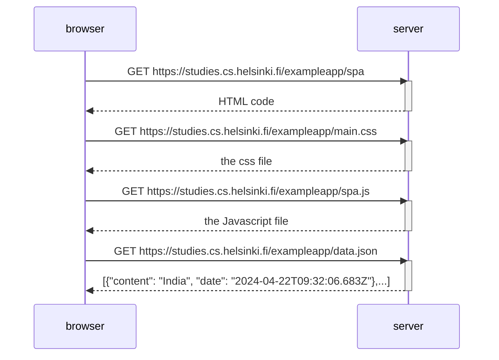

```mermaid

sequenceDiagram
    participant browser
    participant server
   
    browser->>server: GET  https://studies.cs.helsinki.fi/exampleapp/spa
    activate server
    server-->>browser: HTML code
    deactivate server
    
    browser->>server: GET https://studies.cs.helsinki.fi/exampleapp/main.css
    activate server
    server-->>browser: the css file
    deactivate server
    
    browser->>server: GET https://studies.cs.helsinki.fi/exampleapp/spa.js
    activate server
    server-->>browser: the Javascript file
    deactivate server
    
    browser->>server: GET https://studies.cs.helsinki.fi/exampleapp/data.json
    activate server
    server-->>browser: [{"content": "India", "date": "2024-04-22T09:32:06.683Z"},...]
    deactivate server
```
